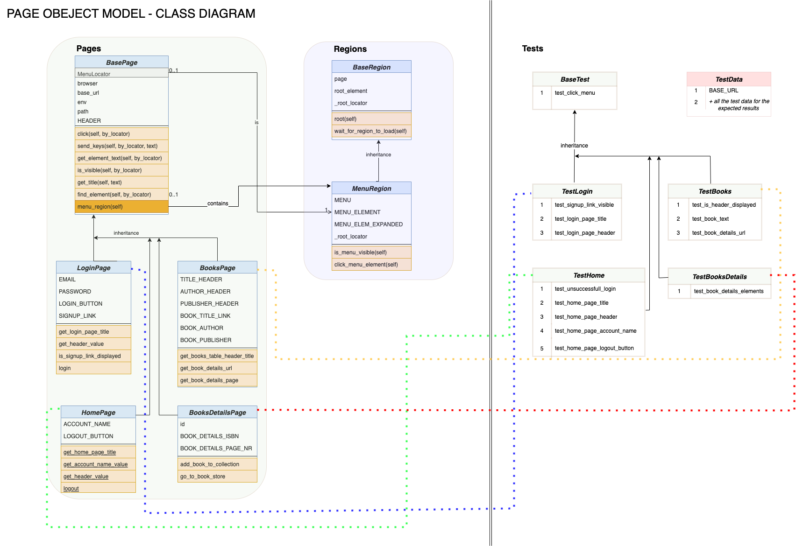

POM-Demo Tests
===============================

POM-Demo Tests is a suite of UI automated tests build on Selenium and Python for testing a sample web application.

Running the Tests Locally
=========================

* System requirements:
  * python 3
  * pip

* Clone this repo

* Next, create and activate a virtual environment:

        virtualenv ve-pom -p python3
        source ve-pom/bin/activate

* Create & update a file `.env` and then export the secrets to environment variables (for an example, check .env.example file): 
        
        cp .env.example .env
        source .env

* Install packages and project dependencies:

        pip install -r requirements.txt

* Run all tests or a certain UI test, on a given environment:

        pytest -v -s --env PROD
        pytest tests/login_page/test_login_page.py -v -s --env PROD
        pytest tests/login_page/test_login_page.py -v -s -nauto --html=.reports/POM-demo3.html --capture=tee-sys --env QA --browser chrome

* Run only 1 test on a specific browser: 
        
        pytest -v -s -k test_home_page_title --env PROD --browser firefox

* Run only 1 test on default environment (PROD) and default browser (chrome) : 
        
        pytest -v -s -k test_home_page_title

* Run only smoke tests on default environment (PROD) and default browser (chrome) : 
        
        pytest -v -m smoke

* Run all tests on default environment (PROD) and default browser (chrome) and generate a html report:  
        
        pytest -v -s --html=.reports/POM-demo3.html --capture=tee-sys

* Run parallel tests on default environment (PROD) and default browser (chrome) :  
        
        pytest tests/login_page/test_login_page.py -v -s -nauto
        pytest tests/login_page/test_login_page.py -v -s -n 3